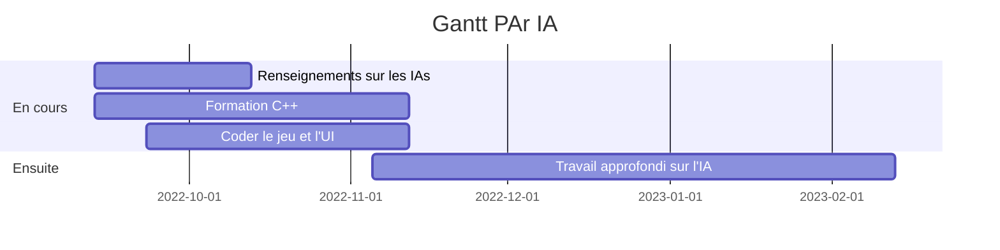

# PAr

To-Do list :

+ Se renseigner sur les types d'IA et d'apprentissage
  + Choisir parmi les possibilités
  + Décider de quelles entrées l'IA aura besoin
+ Coder le jeu (en C++ ?) en sortant les entrées de l'IA
+ Commencer à vraiment travailler sur l'IA

